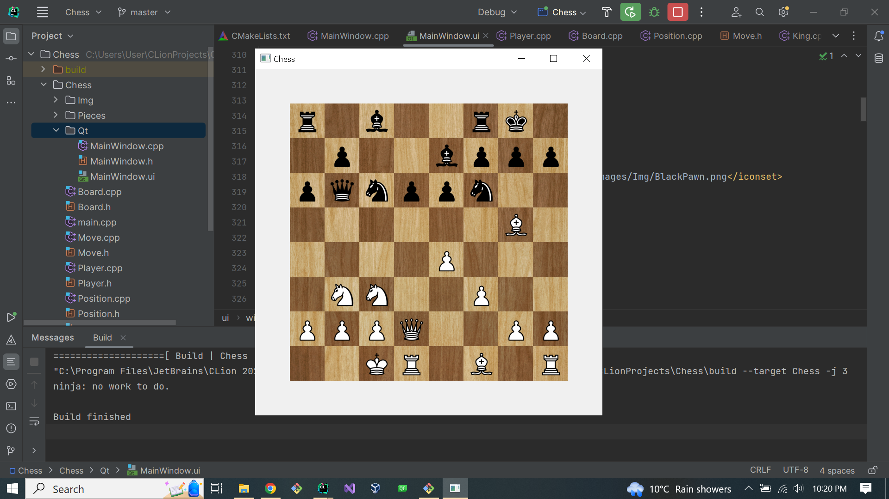
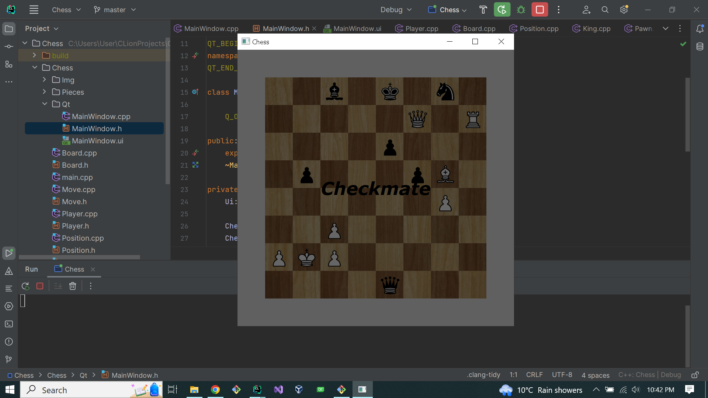

# C++/Qt Chess Game

## Screenshots:





## To get started:

* Clone the repository:
```
git clone https://github.com/EnacheGeorgeAlexandru/Chess.git
```
* Download Qt from: https://www.qt.io/download

* That's it. Build and run it with Qt Creator. Or if you're using a different IDE than Qt Creator, make sure to set __CMAKE_PREFIX_PATH__
to the correct path of your Qt installation

    For example on __Windows__ with a usual Qt installation, this can be done by running:
```
    cmake -DCMAKE_PREFIX_PATH="C:/Qt/6.5.0/mingw_64"
```
    Or if you're using CMake bundled, add this to your IDE's CMake options:
```
    -DCMAKE_PREFIX_PATH="C:/Qt/6.5.0/mingw_64"
